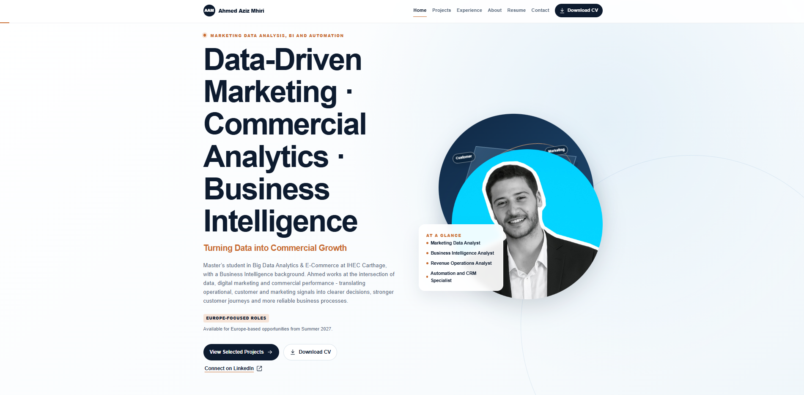
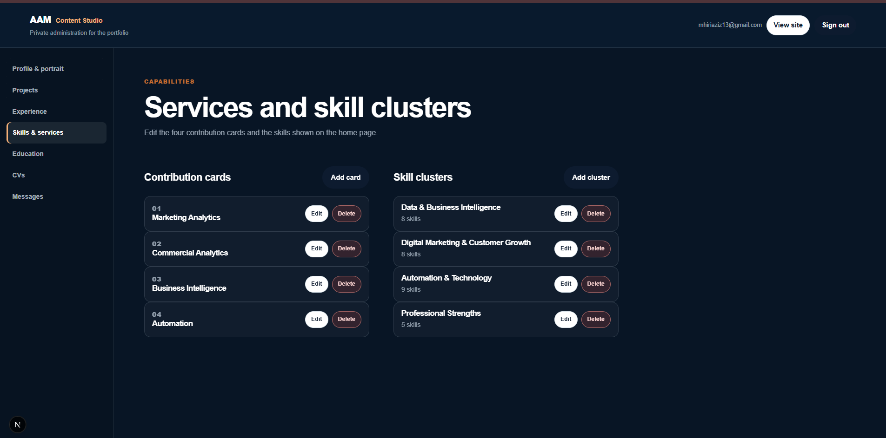
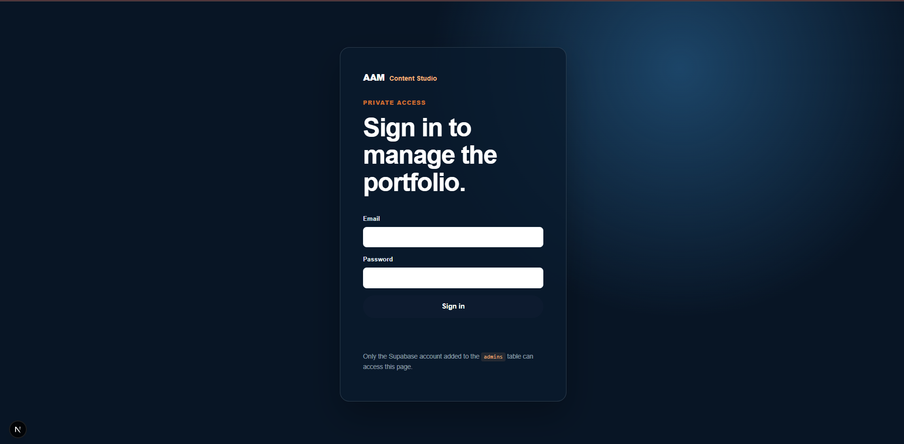
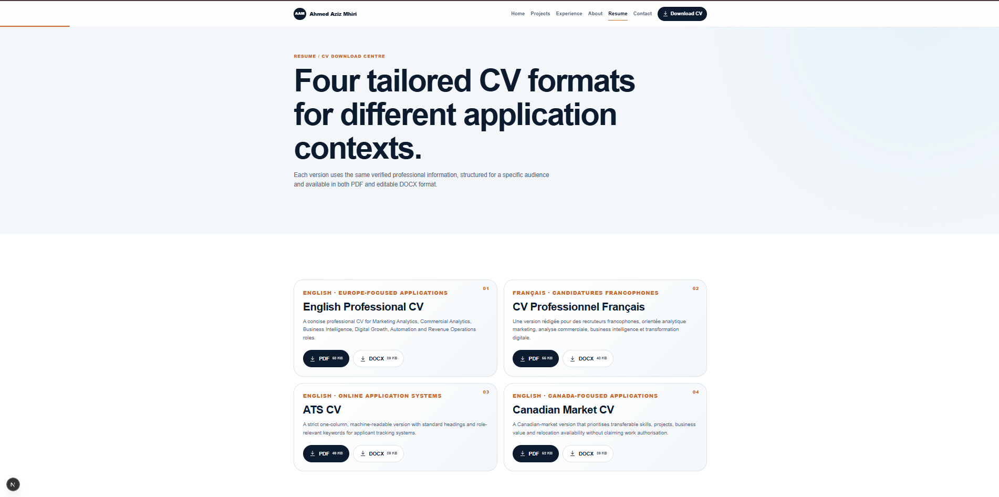
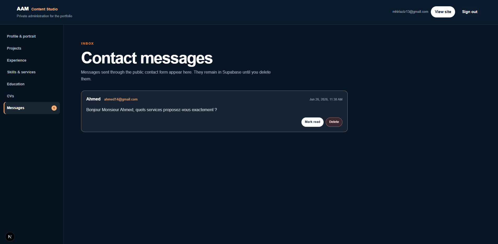

# Ahmed Aziz Mhiri — Portfolio CMS

A professional portfolio platform presenting projects, experience, skills, CVs, and professional positioning in **Data-Driven Marketing, Commercial Analytics, Business Intelligence, Automation, and Digital Growth**.

The platform combines a public-facing professional portfolio with a secure administration area, allowing content to be updated without changing the source code.

## Profile

**Ahmed Aziz Mhiri**
Sousse, Tunisia
Available for Europe-based opportunities from Summer 2027.

* LinkedIn: [Ahmed Aziz Mhiri](https://www.linkedin.com/in/ahmed-aziz-mhiri/)
* Email: [mhiriaziz13@gmail.com](mailto:mhiriaziz13@gmail.com)

## Screenshots

### Homepage



### Projects


### Administration — Skills and Services



### Administration Login



### Resume and CV Download Centre



### Contact Messages Inbox



## Main Features

* Responsive portfolio for desktop, tablet, and mobile.
* Public pages for profile, projects, experience, skills, education, CVs, and contact.
* Individual project case studies with business context, contributions, tools, and outcomes.
* Secure administration area for managing content.
* Create, edit, publish, unpublish, and delete projects.
* Manage professional experience, skills, education, certifications, and profile information.
* Upload and replace portrait images, project covers, CV files, and documents.
* Download centre for English, French, ATS, and Canadian CV versions.
* Contact form connected to an administrative inbox.
* SEO-ready structure with metadata, sitemap, robots file, Open Graph data, and JSON-LD.
* Accessible interface with keyboard navigation, visible focus states, strong contrast, and reduced-motion support.

## Technology Stack

* Next.js
* TypeScript
* Supabase

  * PostgreSQL database
  * Authentication
  * Row Level Security
  * File storage
* Vercel or Netlify
* GitHub

## Local Installation

### Prerequisites

* Node.js 20.9 or newer
* npm
* A Supabase project

### Install

```bash
git clone https://github.com/YOUR-GITHUB-USERNAME/YOUR-REPOSITORY-NAME.git
cd YOUR-REPOSITORY-NAME
npm install
```

### Configure environment variables

Create a `.env.local` file in the project root:

```env
NEXT_PUBLIC_SUPABASE_URL=
NEXT_PUBLIC_SUPABASE_PUBLISHABLE_KEY=
SUPABASE_SERVICE_ROLE_KEY=
```

Never publish `.env.local` or any Supabase secret key on GitHub.

### Run locally

```bash
npm run dev
```

Open:

```text
http://localhost:3000
```

The administration area is available at:

```text
http://localhost:3000/admin/login
```

## Supabase Setup

Before using the administration area:

1. Create a Supabase project.
2. Run `supabase/schema.sql` in the Supabase SQL Editor.
3. Run `supabase/seed.sql` if initial content is needed.
4. Create the administrator account in Supabase Authentication.
5. Run `supabase/create-admin.sql` to authorise that account.
6. Add the Supabase environment variables to `.env.local`.

Only accounts included in the `admins` table can access and modify the administration area.

## Content Management

The administration area lets the owner manage:

* Profile information
* Portrait image
* Projects and case studies
* Work experience
* Skills and services
* Education
* Certifications
* CV files
* Contact messages
* Media files

Portfolio visitors can only see published content.

## Deployment

### Vercel

1. Push this repository to GitHub.
2. Import the repository into Vercel.
3. Add the Supabase environment variables in Vercel Project Settings.
4. Deploy.

### Netlify

1. Push this repository to GitHub.
2. Import the repository into Netlify.
3. Add the Supabase environment variables in Site Configuration.
4. Deploy using the Next.js runtime.

This project requires a dynamic Next.js deployment. Do not deploy it as a static `out` export because authentication, the CMS, and contact messages require server-side functionality.

## Security Notes

* Never commit `.env.local`.
* Never expose `SUPABASE_SERVICE_ROLE_KEY` in client-side code.
* Keep Supabase Row Level Security enabled.
* Only approved administrators should have editing access.
* Regularly review contact messages and uploaded files.

## Repository Structure

```text
app/          Public pages, admin routes, and server logic
components/   Reusable interface components
lib/          Supabase and utility functions
public/       Static files, images, and downloadable CVs
screenshots/  Portfolio screenshots shown in this README
supabase/     Database schema, seed data, and admin SQL scripts
docs/         Setup and deployment documentation
```

## Professional Positioning

Ahmed Aziz Mhiri uses data, automation, and digital marketing to improve commercial performance, customer journeys, operational reliability, and business decisions.

## License

This repository contains a personal professional portfolio. Reuse, reproduction, or redistribution of its content, visual identity, CVs, and project materials requires permission from the owner.
